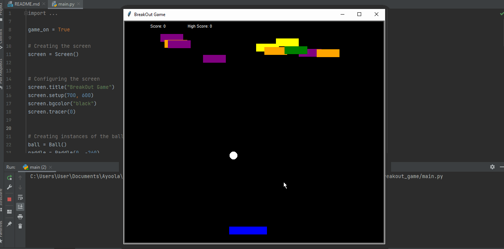
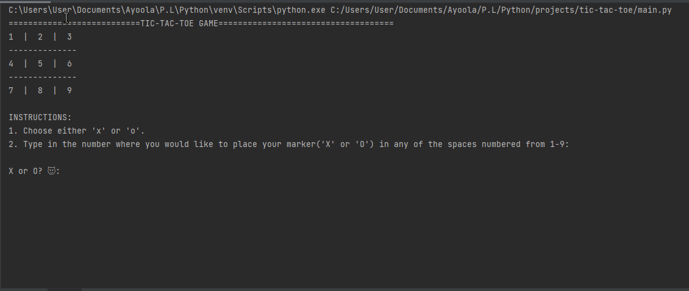

# A collection of classic games built using Python 

## List of Games
- [Breakout Game](#breakout-game)
- [Tic-Tac-Toe](#tic-tac-toe)

### Breakout Game
A clone of the 80s hit game **Breakout**.

- [Link to codebase](https://github.com/Josh-Ay/breakout-game)

 

### Tic-Tac-Toe
A text-based version of the popular Tic Tac Toe game.

- [Link to codebase](https://github.com/Josh-Ay/tic-tac-toe)

